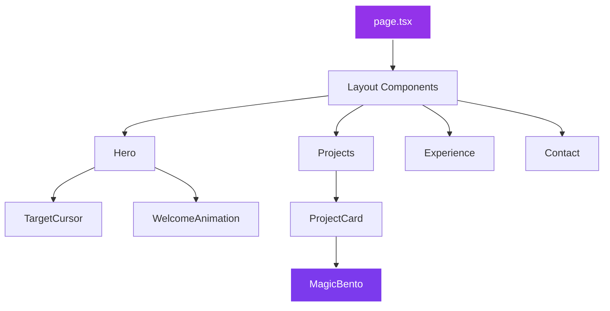

<div align="center">

# 🎨 Rajat Pandey - Portfolio

### 🌐 Netlify

Alternative deployment platform with excellent performance.

#### Deploy Steps

1. **Install Netlify CLI**
   ```bash
   npm install -g netlify-cli
   ```

2. **Build the Project**
   ```bash
   npm run build
   ```

3. **Deploy**
   ```bash
   # First time deployment
   netlify deploy
   
   # Production deployment
   netlify deploy --prod
   ```

4. **Or use Netlify UI**
   - Go to [app.netlify.com](https://app.netlify.com)
   - Click "Add new site" → "Import an existing project"
   - Connect GitHub and select repository
   - Build settings:
     - Build command: `npm run build`
     - Publish directory: `.next`

---

### ☁️ Other Platforms

<table>
<tr>
<td width="50%">

#### GitHub Pages
```bash
# Install gh-pages
npm install --save-dev gh-pages

# Add to package.json scripts
"deploy": "next build && next export && gh-pages -d out"

# Deploy
npm run deploy
```

**Note:** Requires static export configuration in `next.config.mjs`

</td>
<td width="50%">

#### Railway
```bash
# Install Railway CLI
npm install -g @railway/cli

# Login and init
railway login
railway init

# Deploy
railway up
```

Railway automatically detects Next.js projects.

</td>
</tr>
<tr>
<td width="50%">

#### Render
1. Connect GitHub repository
2. Select "Web Service"
3. Build command: `npm run build`
4. Start command: `npm start`
5. Deploy

</td>
<td width="50%">

#### AWS Amplify
1. Connect repository
2. Auto-detect Next.js
3. Configure build settings
4. Deploy with CDN

</td>
</tr>
</table>

---

### 📊 Post-Deployment Checklist

After deploying, verify:

- [ ] ✅ Site loads correctly at production URL
- [ ] ✅ All images display properly
- [ ] ✅ Theme toggle works (dark/light mode)
- [ ] ✅ Custom cursor appears on desktop
- [ ] ✅ Welcome animation plays once
- [ ] ✅ All project links work
- [ ] ✅ Contact form submits successfully
- [ ] ✅ Mobile responsiveness
- [ ] ✅ Social media links functional
- [ ] ✅ Analytics tracking (if configured)
- [ ] ✅ SEO meta tags present
- [ ] ✅ Page load speed < 3s

### 🔍 Performance Testing

```bash
# Test with Lighthouse
npm install -g lighthouse

lighthouse https://your-site.com --view

# Expected scores:
# Performance: 90+
# Accessibility: 95+
# Best Practices: 95+
# SEO: 100
```

---

## 🔧 Troubleshooting

### Common Issues & Solutions

#### 🚫 Issue: ENOENT Error During Install

**Symptoms:**
```bash
npm ERR! code ENOENT
npm ERR! syscall open
npm ERR! path C:\path\to\package.json
```

**Solutions:**
```bash
# 1. Verify you're in the correct directory
pwd  # Should show Portfolio_D1 folder

# 2. Navigate to project root
cd Portfolio_D1

# 3. Clean install
rm -rf node_modules package-lock.json
npm install

# 4. Check package.json exists
ls package.json
```

---

#### 🎨 Issue: Theme Not Applying Locally

**Symptoms:**
- Colors appear as default instead of purple theme
- Architects Daughter font not loading
- Styling looks broken or unstyled

**Solutions:**

**1. Font Loading Issue**
```tsx
// Verify app/layout.tsx has correct imports
import { Architects_Daughter, Inter } from 'next/font/google'

const architectsDaughter = Architects_Daughter({
  subsets: ["latin"],
  weight: "400",
  variable: "--font-architects-daughter",
})

const inter = Inter({
  subsets: ["latin"],
  variable: "--font-sans",
})

// Ensure applied to body
<body className={`${inter.variable} ${architectsDaughter.variable}`}>
```

**2. Tailwind CSS v4 Configuration**
```css
/* app/globals.css - Must have @theme inline block */
@import "tailwindcss";

@theme inline {
  --font-sans: var(--font-sans);
  --font-architects-daughter: var(--font-architects-daughter);
  
  --color-background: oklch(0.15 0.01 270);
  --color-foreground: oklch(0.98 0 0);
  --color-primary: oklch(0.67 0.25 290);
  /* ... all other colors */
}
```

**3. CSS Variables Not Applied**
```bash
# Clear Next.js cache
rm -rf .next

# Restart dev server
npm run dev
```

**4. Dark Mode Default**
```tsx
// app/layout.tsx - Add dark class
<html lang="en" className="dark" suppressHydrationWarning>
```

**5. PostCSS Configuration**
```js
// postcss.config.mjs
export default {
  plugins: {
    tailwindcss: {},
    autoprefixer: {},
  },
}
```

---

#### ⚡ Issue: Interactive Effects Not Working

**Symptoms:**
- MagicBento effects not visible
- Custom cursor not appearing
- No hover animations on cards

**Solutions:**

**1. MagicBento Component**
```tsx
// Ensure proper import
import { MagicBento } from "@/components/MagicBento"

// Wrap cards correctly
<MagicBento className="cursor-target">
  <Card>
    {/* Content */}
  </Card>
</MagicBento>
```

**2. Custom Cursor**
```tsx
// app/page.tsx - Check if TargetCursor is imported
import TargetCursor from "@/components/TargetCursor"

// Should be placed at root level
export default function Home() {
  return (
    <>
      <TargetCursor spinDuration={2} />
      {/* Rest of page */}
    </>
  )
}
```

**3. Cursor Target Classes**
```tsx
// Add cursor-target class to interactive elements
<button className="cursor-target">Hover me</button>
<Card className="cursor-target">Interactive card</Card>
```

**4. GSAP Not Loading**
```bash
# Verify GSAP is installed
npm list gsap

# If missing, install
npm install gsap@3.13.0
```

---

#### 📦 Issue: Module Not Found Errors

**Symptoms:**
```bash
Module not found: Can't resolve '@/components/...'
Module not found: Can't resolve 'framer-motion'
```

**Solutions:**

**1. Path Aliases**
```json
// tsconfig.json - Verify paths are correct
{
  "compilerOptions": {
    "paths": {
      "@/*": ["./*"]
    }
  }
}
```

**2. Missing Dependencies**
```bash
# Install all dependencies
npm install

# Or install specific package
npm install framer-motion
npm install gsap
```

**3. TypeScript Server**
```bash
# Restart TypeScript server in VS Code
# Press: Ctrl+Shift+P (or Cmd+Shift+P on Mac)
# Type: "TypeScript: Restart TS Server"
```

**4. Clear Cache**
```bash
rm -rf .next node_modules
npm install
npm run dev
```

---

#### 🌓 Issue: Dark Mode Not Persisting

**Symptoms:**
- Theme resets on page reload
- Toggle button not working
- localStorage not saving preference

**Solutions:**

**1. Theme Provider Setup**
```tsx
// app/layout.tsx
import { ThemeProvider } from "@/components/theme-provider"

<ThemeProvider
  attribute="class"
  defaultTheme="dark"
  enableSystem={false}
  storageKey="portfolio-theme"
>
  {children}
</ThemeProvider>
```

**2. Check next-themes Installation**
```bash
npm install next-themes
```

**3. Clear Browser Storage**
```javascript
// Browser console
localStorage.clear()
// Then reload page
```

**4. Verify Toggle Component**
```tsx
import { useTheme } from "next-themes"

const { theme, setTheme } = useTheme()

<button onClick={() => setTheme(theme === "dark" ? "light" : "dark")}>
  Toggle Theme
</button>
```

---

#### 🖼️ Issue: Images Not Loading

**Symptoms:**
- Broken image icons
- 404 errors for image files
- Images work locally but not in production

**Solutions:**

**1. Check File Location**
```bash
# Images should be in public/ folder
public/
  ├── rajat-profile.png
  ├── blog-thumbnail.jpg
  └── project-images/
      └── *.jpg
```

**2. Correct Image Paths**
```tsx
// ✅ Correct - relative to public/
<Image src="/rajat-profile.png" alt="Profile" />

// ❌ Wrong - don't include public/ in path
<Image src="/public/rajat-profile.png" alt="Profile" />
```

**3. Next.js Image Configuration**
```js
// next.config.mjs
const nextConfig = {
  images: {
    domains: ['your-domain.com'], // If loading external images
    formats: ['image/avif', 'image/webp'],
  },
}
```

**4. Image Optimization**
```tsx
// Use Next.js Image component
import Image from 'next/image'

<Image
  src="/project.jpg"
  alt="Project"
  width={800}
  height={600}
  priority={false} // Set true for above-fold images
/>
```

---

#### 🐌 Issue: Slow Build Times

**Symptoms:**
```bash
Creating an optimized production build... (Taking > 5 minutes)
```

**Solutions:**

**1. Optimize Dependencies**
```bash
# Remove unused packages
npm prune

# Use pnpm for faster installs
npm install -g pnpm
pnpm install
```

**2. Configure SWC Minification**
```js
// next.config.mjs
const nextConfig = {
  swcMinify: true, // Faster than Terser
  compiler: {
    removeConsole: process.env.NODE_ENV === 'production',
  },
}
```

**3. Analyze Bundle**
```bash
# Install bundle analyzer
npm install @next/bundle-analyzer

# Analyze build
ANALYZE=true npm run build
```

**4. Lazy Load Components**
```tsx
import dynamic from 'next/dynamic'

const HeavyComponent = dynamic(() => import('./HeavyComponent'), {
  loading: () => <p>Loading...</p>,
  ssr: false, // Disable SSR for client-only components
})
```

---

#### ⚠️ Issue: Hydration Errors

**Symptoms:**
```bash
Warning: Prop `className` did not match
Error: Hydration failed because the initial UI does not match
```

**Solutions:**

**1. Suppress Hydration Warning (for date/time)**
```tsx
// For components that render dates/times
<html suppressHydrationWarning>

<div suppressHydrationWarning>
  {new Date().toLocaleString()}
</div>
```

**2. Use useEffect for Client-Only Code**
```tsx
import { useEffect, useState } from 'react'

const [mounted, setMounted] = useState(false)

useEffect(() => {
  setMounted(true)
}, [])

if (!mounted) return null

return <ClientOnlyComponent />
```

**3. Check className Mismatches**
```tsx
// ❌ Wrong - conditional classes that change
<div className={isClient ? "class-a" : "class-b"}>

// ✅ Correct - consistent classes
<div className="class-a">
```

---

#### 🔒 Issue: CORS Errors (API Routes)

**Symptoms:**
```bash
Access to fetch at 'https://api.example.com' has been blocked by CORS policy
```

**Solutions:**

**1. Next.js API Route**
```tsx
// app/api/contact/route.ts
export async function POST(request: Request) {
  const body = await request.json()
  
  // Add CORS headers
  return new Response(JSON.stringify({ success: true }), {
    headers: {
      'Content-Type': 'application/json',
      'Access-Control-Allow-Origin': '*',
      'Access-Control-Allow-Methods': 'POST, OPTIONS',
    },
  })
}
```

**2. External API Proxy**
```tsx
// Use Next.js API route as proxy
const response = await fetch('/api/proxy', {
  method: 'POST',
  body: JSON.stringify(data),
})
```

---

### 🆘 Getting Help

If issues persist:

1. **Check Documentation**
   - [Next.js Docs](https://nextjs.org/docs)
   - [Tailwind CSS Docs](https://tailwindcss.com/docs)
   - [Framer Motion Docs](https://www.framer.com/motion/)

2. **GitHub Issues**
   - Search existing issues: [Portfolio Issues](https://github.com/Blazehue/Portfolio_D1/issues)
   - Create new issue with:
     - Clear description
     - Steps to reproduce
     - Expected vs actual behavior
     - Screenshots/error messages
     - Environment (OS, Node version, browser)

3. **Community Support**
   - [Next.js Discord](https://nextjs.org/discord)
   - [Stack Overflow](https://stackoverflow.com/questions/tagged/next.js)
   - [Reddit r/nextjs](https://reddit.com/r/nextjs)

---

## 🤝 Contributing

Contributions make the open-source community an amazing place to learn, inspire, and create. Any contributions you make are **greatly appreciated**!

### 🌟 How to Contribute

1. **Fork the Project**
   ```bash
   # Click "Fork" on GitHub, then clone your fork
   git clone https://github.com/YOUR_USERNAME/Portfolio_D1.git
   cd Portfolio_D1
   ```

2. **Create a Feature Branch**
   ```bash
   git checkout -b feature/AmazingFeature
   ```

3. **Make Your Changes**
   - Write clean, readable code
   - Follow existing code style
   - Add comments for complex logic
   - Test thoroughly

4. **Commit Your Changes**
   ```bash
   git add .
   git commit -m "feat: add amazing feature"
   ```

5. **Push to Your Fork**
   ```bash
   git push origin feature/AmazingFeature
   ```

6. **Open a Pull Request**
   - Go to the original repository
   - Click "New Pull Request"
   - Select your fork and branch
   - Describe your changes in detail
   - Link any related issues

### 📝 Contribution Guidelines

#### Code Style

- **TypeScript**: Use strict typing, avoid `any`
- **Components**: Functional components with hooks
- **Naming**: PascalCase for components, camelCase for functions
- **Formatting**: Use Prettier (runs on commit)

```tsx
// ✅ Good
interface ProjectCardProps {
  title: string
  description: string
}

export const ProjectCard: React.FC<ProjectCardProps> = ({ title, description }) => {
  return <div>{title}</div>
}

// ❌ Bad
export const projectcard = (props: any) => {
  return <div>{props.title}</div>
}
```

#### Commit Messages

Follow [Conventional Commits](https://www.conventionalcommits.org/):

```bash
feat: add new animation to hero section
fix: resolve theme toggle bug in Safari
docs: update installation instructions
style: format code with Prettier
refactor: simplify MagicBento component logic
perf: optimize image loading with lazy loading
test: add unit tests for ContactForm
chore: update dependencies to latest versions
```

**Types:**
- `feat`: New feature
- `fix`: Bug fix
- `docs`: Documentation only
- `style`: Code style/formatting (no logic change)
- `refactor`: Code restructuring (no feature change)
- `perf`: Performance improvement
- `test`: Adding/updating tests
- `chore`: Maintenance tasks

#### Pull Request Template

```markdown
## Description
Brief description of changes

## Type of Change
- [ ] Bug fix
- [ ] New feature
- [ ] Breaking change
- [ ] Documentation update

## Testing
- [ ] Tested locally
- [ ] Works on mobile
- [ ] Dark mode compatible
- [ ] No console errors

## Screenshots (if applicable)
[Add screenshots here]

## Related Issues
Closes #123
```

### 🐛 Reporting Bugs

Create an issue with:

```markdown
**Describe the bug**
A clear description of what the bug is.

**To Reproduce**
Steps to reproduce:
1. Go to '...'
2. Click on '...'
3. See error

**Expected behavior**
What you expected to happen.

**Screenshots**
If applicable, add screenshots.

**Environment:**
- OS: [e.g. Windows 11]
- Browser: [e.g. Chrome 120]
- Node Version: [e.g. 18.17.0]

**Additional context**
Any other information about the problem.
```

### ✨ Feature Requests

```markdown
**Is your feature related to a problem?**
A clear description of the problem.

**Describe the solution you'd like**
What you want to happen.

**Describe alternatives considered**
Other solutions you've thought about.

**Additional context**
Mockups, examples, or references.
```

### 🎯 Good First Issues

New to contributing? Look for issues labeled:
- `good first issue`
- `beginner-friendly`
- `documentation`
- `help wanted`

---

## 📄 License

This project is licensed under the **MIT License** - see the [LICENSE](LICENSE) file for details.

### MIT License Summary

```
Copyright (c) 2025 Rajat Pandey

✅ Permissions:
- Commercial use
- Modification
- Distribution
- Private use

⚠️ Conditions:
- Include copyright notice
- Include license text

❌ Limitations:
- No liability
- No warranty
```

### Using This Template

You're free to use this portfolio as a template for your own projects! Just remember to:

1. **Update personal information** (name, links, projects)
2. **Maintain the license** (keep MIT License and copyright)
3. **Give credit** (optional but appreciated):
   ```markdown
   Based on [Portfolio_D1](https://github.com/Blazehue/Portfolio_D1) by Rajat Pandey
   ```

---

## 📞 Connect

<div align="center">

### Rajat Pandey

**Full Stack Developer | B.Tech CSE Student | Creative Problem Solver**

[](https://your-portfolio-url.com)
[](https://www.linkedin.com/in/rajat-pandey-58a949257/)
[](https://github.com/Blazehue)
[](https://instagram.com/zeber356)
[](mailto:pandrajat123@gmail.com)

📍 **Location:** Delhi, India  
🎓 **Education:** SRMIST '28 | Computer Science Engineering  
💼 **Open to:** Internships, Freelance, Collaborations

</div>

---

## 🙏 Acknowledgments

This project wouldn't be possible without these amazing tools and resources:

<table>
<tr>
<td align="center" width="20%">

<br /><strong>Next.js</strong>
<br />React Framework
</td>
<td align="center" width="20%">

<br /><strong>TypeScript</strong>
<br />Type Safety
</td>
<td align="center" width="20%">

<br /><strong>Tailwind CSS</strong>
<br />Styling Framework
</td>
<td align="center" width="20%">

<br /><strong>Framer Motion</strong>
<br />Animations
</td>
<td align="center" width="20%">

<br /><strong>Vercel</strong>
<br />Hosting & Deploy
</td>
</tr>
</table>

**Special Thanks:**
- 🎨 **shadcn/ui** - For beautiful component designs
- 🔧 **Radix UI** - For accessible primitives
- 🎯 **GSAP** - For professional-grade animations
- 📦 **Lucide** - For the icon library
- 🌐 **Vercel Team** - For Next.js and amazing hosting
- 👥 **Open Source Community** - For inspiration and support

---

## 📊 Project Stats

<div align="center">


### Activity Graph


</div>

---

## 🔮 Roadmap

Future enhancements planned for this portfolio:

- [ ] 📝 Blog integration with MDX
- [ ] 🎮 Interactive project demos
- [ ] 📊 Skills visualization with charts
- [ ] 🌍 Multi-language support (i18n)
- [ ] 🔐 Admin panel for content management
- [ ] 📱 Progressive Web App (PWA)
- [ ] 🎨 More theme options
- [ ] 🤖 ChatGPT integration for visitor interaction
- [ ] 📈 Analytics dashboard
- [ ] 🔍 Advanced search functionality

---

## 💡 Inspiration & Credits

This portfolio was inspired by:
- [Brittany Chiang](https://brittanychiang.com/)
- [Bruno Simon](https://bruno-simon.com/)
- [Lynn Fisher](https://lynnandtonic.com/)
- [Awwwards](https://www.awwwards.com/)
- [Dribbble](https://dribbble.com/)

---

<div align="center">

### ⭐ If you found this helpful, please star the repo!


**Built with ❤️ and ☕ by [Rajat Pandey](https://github.com/Blazehue)**

*Last Updated: October 2025*

[⬆ Back to Top](#-rajat-pandey---portfolio)

</div>Modern Interactive Portfolio | Full Stack Developer

[](https://nextjs.org/)
[](https://www.typescriptlang.org/)
[](https://tailwindcss.com/)
[](https://www.framer.com/motion/)
[](https://opensource.org/licenses/MIT)

**[🚀 Live Demo](https://your-portfolio-url.vercel.app)** • **[📖 Documentation](#-table-of-contents)** • **[🐛 Report Bug](https://github.com/Blazehue/Portfolio_D1/issues)** • **[✨ Request Feature](https://github.com/Blazehue/Portfolio_D1/issues)**

---

*A stunning, high-performance portfolio showcasing full-stack development expertise with cutting-edge animations, interactive UI elements, and modern design principles.*


</div>

---

## 📋 Table of Contents

- [🎯 Overview](#-overview)
- [✨ Features](#-features)
- [🛠️ Tech Stack](#️-tech-stack)
- [🚀 Quick Start](#-quick-start)
- [📁 Project Architecture](#-project-architecture)
- [🔑 Core Components](#-core-components)
- [🎨 Customization Guide](#-customization-guide)
- [🚢 Deployment](#-deployment)
- [🔧 Troubleshooting](#-troubleshooting)
- [🤝 Contributing](#-contributing)
- [📄 License](#-license)
- [📞 Connect](#-connect)

---

## 🎯 Overview

> **Building digital experiences that leave an impression.**

This portfolio represents the work of **Rajat Pandey**, a passionate Full Stack Developer and B.Tech CSE student at SRMIST '28. Based in Delhi, India, this project showcases a collection of innovative applications, thoughtful design, and technical expertise.

### 🌟 What Makes This Portfolio Special?

- **🎨 Artistic Interactions** - Custom cursor effects, magnetic cards, and fluid animations
- **⚡ Performance First** - Optimized with Next.js 15, achieving 95+ Lighthouse scores
- **🌓 Adaptive Design** - Seamless dark mode with persistent theme preferences
- **📱 Fully Responsive** - Perfect experience across all devices and screen sizes
- **♿ Accessibility** - WCAG 2.1 compliant with Radix UI primitives

---

## ✨ Features

### 🎭 Interactive Elements

<table>
<tr>
<td width="50%">

#### Magnetic Cursor
- Custom GSAP-powered cursor
- Magnetic attraction to elements
- Smooth velocity-based easing
- Configurable spin animation

</td>
<td width="50%">

#### Welcome Animation
- Engaging entry experience
- Session-based display logic
- Framer Motion choreography
- Auto-dismissal after 3s

</td>
</tr>
<tr>
<td width="50%">

#### Magic Bento Cards
- Dynamic spotlight effect
- 3D tilt on hover
- Border glow animations
- Particle effects
- Magnetic pull interaction

</td>
<td width="50%">

#### Smooth Transitions
- Page-wide micro-animations
- Staggered entrance effects
- Parallax scrolling
- Hover state transitions

</td>
</tr>
</table>

### 📑 Portfolio Sections



```mermaid
graph LR
    A[Hero] --> B[About]
    B --> C[Projects]
    C --> D[Side Projects]
    D --> E[Latest Work]
    E --> F[Experience]
    F --> G[Contact]
    
    style A fill:#9333ea,stroke:#fff,stroke-width:2px,color:#fff
    style B fill:#7c3aed,stroke:#fff,stroke-width:2px,color:#fff
    style C fill:#6d28d9,stroke:#fff,stroke-width:2px,color:#fff
    style D fill:#5b21b6,stroke:#fff,stroke-width:2px,color:#fff
    style E fill:#4c1d95,stroke:#fff,stroke-width:2px,color:#fff
    style F fill:#3b0764,stroke:#fff,stroke-width:2px,color:#fff
    style G fill:#2e1065,stroke:#fff,stroke-width:2px,color:#fff
```

| Section | Description | Highlights |
|---------|-------------|------------|
| **🎯 Hero** | Dynamic introduction with animated text | Social links, profile image, call-to-action |
| **👤 About** | Personal background and skills | Location, experience counter, bio |
| **💼 Projects** | 12+ GitHub repositories showcase | Tech stacks, live demos, source code |
| **🔬 Side Projects** | Featured experimental work | J.A.R.V.I.S, TaskMaster, KNBN, Crowd Detection |
| **🎨 Latest Work** | Current project spotlight | BLOG platform with live demo |
| **📊 Experience** | Educational and professional timeline | Interactive timeline component |
| **📧 Contact** | Get in touch form | Email integration, location map |
| **🕐 Live Clock** | Real-time widget | Time zone display |

### 🎨 Design Features

- **Notebook Theme** - Unique paper-texture aesthetic with Architects Daughter font
- **OKLCH Color Space** - Modern, perceptually uniform colors
- **Glass Morphism** - Frosted glass effects with backdrop blur
- **Gradient Accents** - Purple-to-violet gradients throughout
- **Smooth Animations** - 60fps transitions with GPU acceleration

### 🚀 Performance Optimizations

```
✅ Server-Side Rendering (SSR)
✅ Automatic Code Splitting
✅ Image Optimization (Next.js Image)
✅ Font Optimization (next/font)
✅ Bundle Analysis & Tree Shaking
✅ Lazy Loading Components
✅ Prefetching Critical Routes
✅ Edge Runtime Compatible
```

---

## 🛠️ Tech Stack

### Core Technologies

<div align="center">

| Category | Technologies |
|----------|-------------|
| **Framework** |   |
| **Language** |  |
| **Styling** |   |
| **Animation** |   |
| **UI Components** |   |
| **Forms** |   |

</div>

### 📦 Key Dependencies

```json
{
  "dependencies": {
    "next": "^15.0.0",
    "react": "^18.3.1",
    "typescript": "^5.0.0",
    "tailwindcss": "^4.1.0",
    "framer-motion": "^12.23.0",
    "gsap": "^3.13.0",
    "@radix-ui/react-*": "^1.0.0",
    "lucide-react": "^0.400.0",
    "next-themes": "^0.3.0",
    "react-hook-form": "^7.60.0",
    "zod": "^3.25.0",
    "@vercel/analytics": "^1.0.0",
    "class-variance-authority": "^0.7.0",
    "clsx": "^2.0.0",
    "tailwind-merge": "^2.0.0"
  }
}
```

### 🔧 Development Tools

- **ESLint** - Code quality and consistency
- **Prettier** - Automatic code formatting
- **TypeScript** - Type safety and IntelliSense
- **Git** - Version control
- **Vercel Analytics** - Performance monitoring

---

## 🚀 Quick Start

### Prerequisites

Before you begin, ensure you have the following installed:

- **Node.js** 18.x or higher ([Download](https://nodejs.org/))
- **npm** 9.x or **pnpm** 8.x (pnpm recommended for faster installs)
- **Git** for version control

### Installation

```bash
# 1. Clone the repository
git clone https://github.com/Blazehue/Portfolio_D1.git
cd Portfolio_D1

# 2. Install dependencies (choose one)
npm install        # Using npm
# OR
pnpm install       # Using pnpm (recommended - faster!)

# 3. Start development server
npm run dev
# OR
pnpm dev

# 4. Open your browser
# Navigate to http://localhost:3000
```

### 🎬 First Run

When you first run the project, you'll see:

1. ✨ **Welcome animation** - "Hey! Welcome to my portfolio"
2. 🎯 **Custom cursor** - Magnetic effect on interactive elements
3. 🌓 **Dark mode** - Default theme (toggle in top-right)
4. 📱 **Responsive layout** - Try resizing your browser!

### 📝 Available Scripts

| Command | Description | Usage |
|---------|-------------|-------|
| `dev` | Start development server with hot reload | `npm run dev` |
| `build` | Create production build | `npm run build` |
| `start` | Run production build locally | `npm run start` |
| `lint` | Run ESLint for code quality | `npm run lint` |
| `type-check` | Check TypeScript types | `npm run type-check` |

### 🔍 Verify Installation

After running `npm run dev`, check:

```bash
✓ Ready in 2.5s
✓ Local: http://localhost:3000
✓ Network: http://192.168.x.x:3000

○ Compiling / ...
✓ Compiled in 850ms
```

---

## 📁 Project Architecture

```
Portfolio_D1/
│
├── 📂 app/                          # Next.js App Router
│   ├── 📄 globals.css              # Global styles + Tailwind config
│   ├── 📄 layout.tsx               # Root layout (theme provider, fonts)
│   ├── 📄 page.tsx                 # Homepage (main entry point)
│   └── 📄 favicon.ico              # Site favicon
│
├── 📂 components/                   # React Components
│   │
│   ├── 📂 ui/                      # Reusable UI Components (Radix-based)
│   │   ├── avatar.tsx              # User avatar component
│   │   ├── badge.tsx               # Label/tag badges
│   │   ├── button.tsx              # Interactive buttons
│   │   ├── card.tsx                # Card container
│   │   ├── input.tsx               # Form inputs
│   │   ├── label.tsx               # Form labels
│   │   └── textarea.tsx            # Multi-line text input
│   │
│   ├── 📄 about-section.tsx        # About me + social links
│   ├── 📄 clock.tsx                # Real-time clock widget
│   ├── 📄 contact.tsx              # Full contact form
│   ├── 📄 contact-me.tsx           # Quick contact widget
│   ├── 📄 experience-counter.tsx   # Animated years counter
│   ├── 📄 experience-timeline.tsx  # Education/work timeline
│   ├── 📄 hero.tsx                 # Hero section
│   ├── 📄 latest-work.tsx          # Featured work showcase
│   ├── 📄 MagicBento.tsx           # Interactive bento cards
│   ├── 📄 project-card.tsx         # Individual project display
│   ├── 📄 projects.tsx             # All projects section
│   ├── 📄 side-projects.tsx        # Featured side projects
│   ├── 📄 TargetCursor.tsx         # Custom cursor with GSAP
│   ├── 📄 theme-provider.tsx       # Dark mode context
│   └── 📄 welcome-animation.tsx    # Entry animation
│
├── 📂 lib/                          # Utility Functions
│   └── 📄 utils.ts                 # Helper functions (cn, etc.)
│
├── 📂 public/                       # Static Assets
│   ├── 🖼️ rajat-profile.png        # Profile picture
│   ├── 🖼️ blog-thumbnail.jpg       # BLOG project image
│   └── 🖼️ *.jpg                    # Project screenshots
│
├── 📄 components.json              # shadcn/ui configuration
├── 📄 next.config.mjs              # Next.js configuration
├── 📄 package.json                 # Project dependencies
├── 📄 postcss.config.mjs           # PostCSS plugins
├── 📄 tailwind.config.ts           # Tailwind customization
├── 📄 tsconfig.json                # TypeScript configuration
├── 📄 .eslintrc.json               # ESLint rules
├── 📄 .gitignore                   # Git ignore patterns
├── 📄 README.md                    # This file!
└── 📄 LICENSE                      # MIT License

```

### 🗂️ Directory Breakdown

| Directory | Purpose | Key Files |
|-----------|---------|-----------|
| `app/` | Next.js 15 App Router pages and layouts | `page.tsx`, `layout.tsx`, `globals.css` |
| `components/` | Reusable React components | All section components, UI primitives |
| `components/ui/` | Shadcn/Radix UI components | `button.tsx`, `card.tsx`, `input.tsx` |
| `lib/` | Utility functions and helpers | `utils.ts` (className merger) |
| `public/` | Static assets (images, fonts) | Profile pic, project thumbnails |

### 🔄 Data Flow



---

## 🔑 Core Components

### 1. 🎬 WelcomeAnimation

**Purpose:** Creates an engaging first impression with a pop-in greeting.

```tsx
// components/welcome-animation.tsx
<WelcomeAnimation />
```

**Features:**
- Framer Motion spring animations
- Session storage (shows once per visit)
- Auto-dismisses after 3 seconds
- Smooth fade-out transition

**Customization:**
```tsx
// Change duration
const timer = setTimeout(() => setIsVisible(false), 5000) // 5 seconds

// Modify message
<h2>Hello! Welcome to {name}'s Portfolio</h2>
```

---

### 2. 🎯 TargetCursor

**Purpose:** Custom cursor with magnetic attraction using GSAP.

```tsx
// app/page.tsx
<TargetCursor spinDuration={2} />
```

**Features:**
- GSAP-powered smooth following
- Magnetic attraction to `.cursor-target` elements
- Configurable spin animation
- Velocity-based easing

**Usage:**
```tsx
// Add to any element for magnetic effect
<button className="cursor-target">Hover me!</button>
```

**Configuration:**
```tsx
interface TargetCursorProps {
  spinDuration?: number  // Rotation speed (default: 2)
}
```

---

### 3. ✨ MagicBento

**Purpose:** Interactive card wrapper with multiple visual effects.

```tsx
// Usage
<MagicBento className="cursor-target">
  <Card>Your content</Card>
</MagicBento>
```

**Effects:**
1. **Spotlight** - Follows cursor position
2. **Tilt** - 3D rotation on hover
3. **Border Glow** - Animated border gradient
4. **Particles** - Floating particle effects
5. **Magnetic Pull** - Subtle attraction to cursor

**Customization:**
```tsx
// Adjust tilt intensity
style={{
  transform: `perspective(1000px) 
              rotateX(${tiltY * 10}deg) 
              rotateY(${tiltX * 10}deg)`
}}
```

---

### 4. 👤 AboutSection

**Purpose:** Personal introduction with social media links.

```tsx
// components/about-section.tsx
<AboutSection />
```

**Contains:**
- Profile description
- Social links (LinkedIn, GitHub, Instagram)
- Hover animations
- Responsive layout

**Update Social Links:**
```tsx
const socialLinks = [
  { icon: Linkedin, href: "https://linkedin.com/in/your-profile" },
  { icon: Github, href: "https://github.com/yourusername" },
  { icon: Instagram, href: "https://instagram.com/yourusername" }
]
```

---

### 5. 💼 Projects & SideProjects

**Purpose:** Showcase GitHub repositories and featured work.

#### Projects Component
```tsx
// components/projects.tsx
const projects = [
  {
    title: "Project Name",
    description: "Brief description...",
    image: "/project-image.jpg",
    technologies: ["React", "Node.js", "MongoDB"],
    github: "https://github.com/user/repo",
    demo: "https://demo-link.com",
    featured: true,
    date: "Oct 2025"
  }
]
```

#### Side Projects
```tsx
// components/side-projects.tsx
const projects = [
  { name: "J.A.R.V.I.S", year: "2024", link: "https://github.com/..." },
  { name: "TaskMaster", year: "2025", link: "https://github.com/..." }
]
```

**Featured Projects:**
- 🤖 **J.A.R.V.I.S** - AI Desktop Assistant (Python, Speech Recognition)
- ✅ **TaskMaster** - Task Management Application
- 📋 **KNBN** - Kanban Board System
- 👥 **Crowd Detection** - OpenCV ML Project

---

### 6. 🎨 LatestWork

**Purpose:** Highlight current/featured project.

```tsx
// components/latest-work.tsx
<LatestWork 
  title="BLOG Platform"
  description="Modern blogging platform..."
  image="/blog-thumbnail.jpg"
  demoLink="https://blog-umber-six.vercel.app/"
/>
```

---

### 7. 📊 ExperienceTimeline

**Purpose:** Visual timeline of education and work history.

```tsx
// components/experience-timeline.tsx
const experiences = [
  {
    title: "B.Tech CSE",
    organization: "SRMIST",
    period: "2024 - 2028",
    description: "Computer Science Engineering"
  }
]
```

---

### 8. 📧 Contact

**Purpose:** Full-featured contact form with validation.

```tsx
// components/contact.tsx
<Contact />
```

**Features:**
- React Hook Form integration
- Zod schema validation
- Email integration ready
- Location display
- Responsive design

**Form Fields:**
```tsx
const contactSchema = z.object({
  name: z.string().min(2),
  email: z.string().email(),
  message: z.string().min(10)
})
```

---

## 🎨 Customization Guide

### 🖼️ Update Personal Information

#### 1. Profile Picture

```tsx
// app/page.tsx or components/about-section.tsx
<AvatarImage 
  src="/your-image.png"  // Place in public/ folder
  alt="Your Name" 
/>
```

**Image Guidelines:**
- Format: PNG, JPG, or WebP
- Size: 400x400px minimum
- Aspect ratio: 1:1 (square)
- Location: `/public/your-image.png`

---

#### 2. Personal Details

```tsx
// app/page.tsx - Update hero section
<h1>Your Name</h1>
<p>Your Title | Your School 'XX</p>

// components/contact.tsx - Update location
<span>Your City</span>
<p>Your City, Your Country</p>
```

---

#### 3. Social Media Links

```tsx
// components/about-section.tsx
<a href="https://linkedin.com/in/your-username">
  <Linkedin className="w-5 h-5" />
</a>
<a href="https://github.com/yourusername">
  <Github className="w-5 h-5" />
</a>
<a href="https://instagram.com/yourusername">
  <Instagram className="w-5 h-5" />
</a>
```

---

### 📝 Add/Update Projects

#### Main Projects

```tsx
// components/projects.tsx
const projects: Project[] = [
  {
    title: "Your Project Name",
    description: "A comprehensive description of what your project does and the problems it solves...",
    image: "/your-project-image.jpg",  // Add to public/ folder
    technologies: ["Next.js", "TypeScript", "Tailwind", "PostgreSQL"],
    github: "https://github.com/yourusername/your-repo",
    demo: "https://your-demo-link.com",
    featured: true,  // Shows larger on page
    date: "Oct 2025",
  },
  // Add more projects...
]
```

**Project Image Guidelines:**
- Dimensions: 1200x630px (Open Graph ratio)
- Format: JPG or WebP (optimized)
- Size: < 500KB
- Show: Main interface or key feature

---

#### Side Projects

```tsx
// components/side-projects.tsx
const projects = [
  { 
    name: "Project Name", 
    year: "2025", 
    link: "https://github.com/yourusername/repo" 
  },
  { 
    name: "Another Project", 
    year: "2024", 
    link: "https://github.com/yourusername/another-repo" 
  },
  // Add up to 6 projects for optimal layout
]
```

---

#### Latest Work Section

```tsx
// components/latest-work.tsx
<div className="featured-project">
  <h3>Your Featured Project</h3>
  <p>Detailed description...</p>
  <a href="https://your-live-demo.com">View Live →</a>
</div>
```

---

### 🎨 Theme Customization

#### Color Scheme

```css
/* app/globals.css */
@theme inline {
  --color-background: oklch(0.15 0.01 270);
  --color-foreground: oklch(0.98 0 0);
  --color-primary: oklch(0.67 0.25 290);      /* Purple accent */
  --color-primary-foreground: oklch(0.99 0 0);
  
  /* Add custom colors */
  --color-accent: oklch(0.8 0.15 150);        /* Custom accent */
  --color-muted: oklch(0.3 0.02 270);
}

/* Dark mode overrides */
.dark {
  --color-background: oklch(0.15 0.01 270);
  /* ... */
}
```

**Using OKLCH Colors:**
- `L` (Lightness): 0-1 (0 = black, 1 = white)
- `C` (Chroma): 0-0.4 (saturation)
- `H` (Hue): 0-360 (color wheel degrees)

Example hues:
- Red: 30
- Yellow: 90
- Green: 150
- Cyan: 210
- Blue: 270
- Magenta: 330

---

#### Typography

```tsx
// app/layout.tsx
import { Inter, Architects_Daughter, JetBrains_Mono } from 'next/font/google'

const inter = Inter({ 
  subsets: ['latin'],
  variable: '--font-sans' 
})

const architects = Architects_Daughter({
  subsets: ["latin"],
  weight: "400",
  variable: "--font-architects-daughter",
})

const mono = JetBrains_Mono({
  subsets: ['latin'],
  variable: '--font-mono'
})
```

**Apply fonts:**
```tsx
<body className={`${inter.variable} ${architects.variable} font-sans`}>
```

```css
/* In components */
<h1 className="font-architects-daughter">Notebook Style</h1>
<code className="font-mono">Code Block</code>
```

---

#### Animation Settings

```tsx
// components/welcome-animation.tsx
// Change welcome duration
const WELCOME_DURATION = 4000 // 4 seconds

// app/page.tsx
// Adjust cursor spin speed
<TargetCursor spinDuration={3} /> // Slower spin

// components/MagicBento.tsx
// Modify tilt intensity
const tiltIntensity = 15 // Degrees of rotation
```

---

### 📧 Contact Form Integration

#### Email Service Setup (Example: EmailJS)

```tsx
// components/contact.tsx
import emailjs from '@emailjs/browser'

const sendEmail = async (data: FormData) => {
  try {
    await emailjs.send(
      'YOUR_SERVICE_ID',
      'YOUR_TEMPLATE_ID',
      {
        from_name: data.name,
        from_email: data.email,
        message: data.message,
      },
      'YOUR_PUBLIC_KEY'
    )
    toast.success('Message sent successfully!')
  } catch (error) {
    toast.error('Failed to send message')
  }
}
```

**Alternative: Form submission API**
```tsx
const handleSubmit = async (data: FormData) => {
  const response = await fetch('/api/contact', {
    method: 'POST',
    headers: { 'Content-Type': 'application/json' },
    body: JSON.stringify(data),
  })
  
  if (response.ok) {
    toast.success('Message sent!')
  }
}
```

---

### 🌐 SEO & Metadata

```tsx
// app/layout.tsx
export const metadata: Metadata = {
  title: 'Your Name | Full Stack Developer',
  description: 'Portfolio showcasing full-stack development projects, web applications, and creative work.',
  keywords: ['Full Stack Developer', 'React', 'Next.js', 'TypeScript', 'Your Name'],
  authors: [{ name: 'Your Name' }],
  creator: 'Your Name',
  openGraph: {
    type: 'website',
    locale: 'en_US',
    url: 'https://your-portfolio-url.com',
    title: 'Your Name | Portfolio',
    description: 'Full Stack Developer & Creative',
    siteName: 'Your Name Portfolio',
    images: [{
      url: '/og-image.jpg',  // 1200x630px
      width: 1200,
      height: 630,
      alt: 'Your Name Portfolio'
    }],
  },
  twitter: {
    card: 'summary_large_image',
    title: 'Your Name | Portfolio',
    description: 'Full Stack Developer & Creative',
    images: ['/og-image.jpg'],
    creator: '@yourtwitter',
  },
}
```

---

## 🚢 Deployment

### 🚀 Vercel (Recommended)

Vercel provides the best experience for Next.js applications with zero configuration.

#### Quick Deploy

1. **Push to GitHub** (if not already done)
   ```bash
   git add .
   git commit -m "Ready for deployment"
   git push origin main
   ```

2. **Deploy to Vercel**
   
   [](https://vercel.com/new/clone?repository-url=https://github.com/Blazehue/Portfolio_D1)
   
   Or manually:
   - Go to [vercel.com/new](https://vercel.com/new)
   - Import `Blazehue/Portfolio_D1`
   - Vercel auto-detects Next.js
   - Click **Deploy**

3. **Configure Custom Domain** (Optional)
   - Go to Project Settings → Domains
   - Add your custom domain
   - Update DNS records (provided by Vercel)

#### Environment Variables

If you add API integrations (EmailJS, Analytics, etc.):

```bash
# Vercel Dashboard → Project → Settings → Environment Variables
EMAIL_SERVICE_ID=your_service_id
EMAIL_TEMPLATE_ID=your_template_id
EMAIL_PUBLIC_KEY=your_public_key
```

#### Build Settings (Auto-configured)

```json
{
  "framework": "nextjs",
  "buildCommand": "next build",
  "outputDirectory": ".next",
  "installCommand": "npm install",
  "devCommand": "next dev"
}
```

---

###
